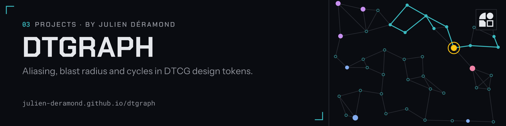
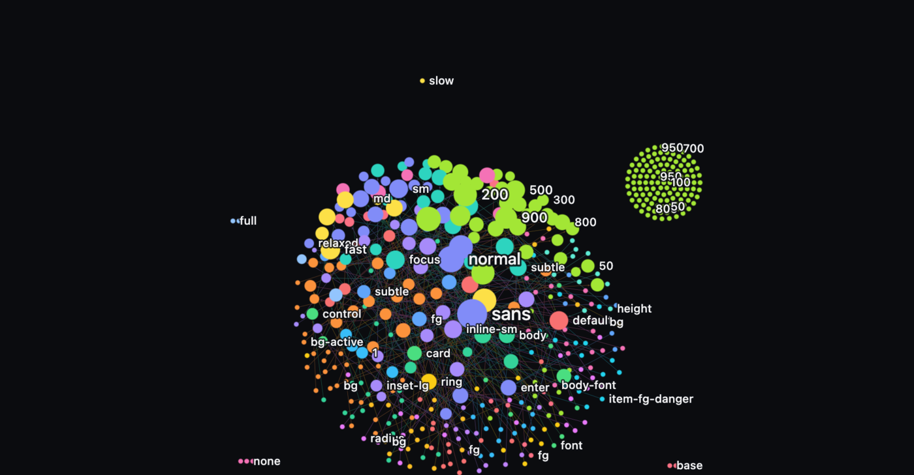

<picture><source srcset=".github/header.svg" type="image/svg+xml"></picture>

<h1 align="center">dtgraph</h1>

  dtgraph turns <a href="https://tr.designtokens.org/">DTCG</a> design token files into an
  interactive dependency graph.
   
  <a href="https://julien-deramond.github.io/dtgraph/"><strong>Open the playground »</strong></a>
   
   
  <a href="#try-it">Try it</a>
  ·
  <a href="#packages">Packages</a>
  ·
  <a href="#documentation">Documentation</a>
  ·
  <a href="https://github.com/julien-deramond/dtgraph/issues/new/choose">Report bug</a>

  
  
  

  

It parses DTCG token files and renders the reference graph between tokens — which
primitives feed which semantic tokens, what breaks if a value changes, and where
cycles hide — as an interactive node graph, so token lineage and blast radius stay
legible as a design system grows.

## Try it

Open the [playground](https://julien-deramond.github.io/dtgraph/) and drop a DTCG file on it
(or a `*.resolver.json` with the files it references, then switch between its contexts):
tokens cluster by what they reference, the most-depended-on primitives are the biggest dots,
hovering spotlights relations, clicking opens a detail panel, `/` searches. Nothing is uploaded.

## Packages

| Package                                    | What it is                                                                                                                             |
| ------------------------------------------- | ---------------------------------------------------------------------------------------------------------------------------------------- |
| [`@dtgraph/core`](packages/core)           | Parse DTCG files and resolver documents, resolve aliases (across files and per context), build the token graph, render a static SVG. |
| [`dtgraph`](packages/cli)                  | CLI: `dtgraph validate` and `dtgraph render` for one or more token files, or a resolver plus its files.                              |
| [`@dtgraph/viewer`](packages/viewer)       | The interactive WebGL map: clusters, blast radius, hover/click focus, search, detail panel.                                          |
| [`@dtgraph/mdx`](packages/mdx)             | `<TokenGraph>` for MDX/Astro pages, static SVG or interactive.                                                                        |
| [`@dtgraph/storybook`](packages/storybook) | Storybook addon panel showing each story's token graph.                                                                               |

## Documentation

Full docs live at <https://julien-deramond.github.io/dtgraph/docs/>.

| Page                                                                                | What's in it                                                                                                   |
| ------------------------------------------------------------------------------------ | ------------------------------------------------------------------------------------------------------------- |
| [Getting started](https://julien-deramond.github.io/dtgraph/docs/getting-started/) | Two ways to start using dtgraph — the playground, or the CLI.                                                  |
| [DTCG primer](https://julien-deramond.github.io/dtgraph/docs/dtcg-primer/)         | What a DTCG token file looks like, for someone who's never seen one before.                                    |
| [Interactive viewer](https://julien-deramond.github.io/dtgraph/docs/viewer/)       | Explore a token graph as a zoomable map — clusters, blast radius, search, and a detail panel for every token. |
| [CLI reference](https://julien-deramond.github.io/dtgraph/docs/cli-reference/)     | Every dtgraph CLI command, flag, and exit code.                                                                |

## Status

Early-stage / pre-release. Core parsing, graph model, and rendering are still being
designed — see the [open issues](https://github.com/julien-deramond/dtgraph/issues) for what's
in progress.

## Contributing

Contributions are welcome. See [CONTRIBUTING.md](CONTRIBUTING.md) for how issues and
pull requests are triaged and reviewed, including the workflow for AI-agent-submitted
issues. To report a bug or request a feature, [open an issue](https://github.com/julien-deramond/dtgraph/issues/new/choose).

## License

[MIT](LICENSE)
