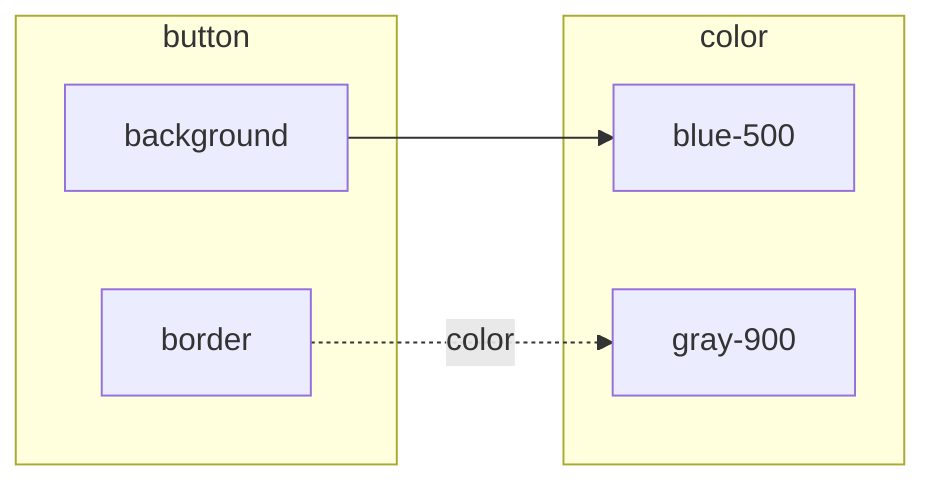

Install with `npm install --global dtgraph`, or run without installing via `npx dtgraph ...`.
This page mirrors the CLI's own `--help` output.

```
Usage: dtgraph [options] [command]

CLI for rendering and validating DTCG design token files with dtgraph

Options:
  -V, --version                  output the version number
  -h, --help                     display help for command

Commands:
  render [options] <files...>    Render one or more DTCG token files (optionally
                                 driven by a resolver) to an SVG token graph, or
                                 to Mermaid text
  validate [options] <files...>  Validate that DTCG token file(s) parse and all
                                 aliases resolve, including cycles
  help [command]                 display help for command
```

Both commands accept plain token files, or a [resolver file](#resolver-files) plus the token
files it references.

## `dtgraph render`

Parses and resolves one or more DTCG token files (aliases resolve across files when more than
one is given) and renders the result to an SVG token graph, or to [Mermaid](#mermaid-output) text.

```
Usage: dtgraph render [options] <files...>

Render one or more DTCG token files (optionally driven by a resolver) to an SVG
token graph, or to Mermaid text

Arguments:
  files                             DTCG token JSON file(s) to render, plus at
                                    most one resolver document

Options:
  -o, --output <file>               write the output to this file instead of
                                    stdout
  -c, --context <modifier=context>  with a resolver: select a modifier context
                                    (repeatable, or comma-separated)
  --format <format>                 output format (choices: "svg", "mermaid",
                                    default: "svg")
  --fence                           with --format mermaid: wrap the diagram in a
                                    ```mermaid code fence
  --full-paths                      with --format mermaid: label nodes with
                                    their full token path, not the last segment
  -h, --help                        display help for command
```

```sh
dtgraph render tokens.json -o graph.svg
dtgraph render color.json typography.json -o graph.svg
dtgraph render tokens.json > graph.svg   # no -o: SVG goes to stdout
dtgraph render ds.resolver.json base.json themes/*.json components.json -c theme=dark -o dark.svg
dtgraph render tokens.json --format mermaid -o graph.mmd
dtgraph render tokens.json --format mermaid --fence   # paste the output into a README, issue or PR
```

### Mermaid output

GitHub, GitLab, Notion and most docs tools render [Mermaid](https://mermaid.js.org/) diagrams
from plain text, so `--format mermaid` gives a token graph you can paste where an image would
have to be hosted. It is a `flowchart LR` with one subgraph per top-level group, alias edges as
solid arrows (`-->`) and composite-member edges as dotted arrows labeled with the member
(`-.->|"color"|` on a `border` token), each pointing from the token that references to the token
referenced. Nodes are labeled with their last path segment, or their full path with
`--full-paths`; `--fence` wraps the diagram in a ` ```mermaid ` block ready to paste into
Markdown:

````md

````

Node ids are built from the token path plus a short hash, so they stay the same from one run
to the next and a regenerated diagram diffs cleanly. Mermaid lays the diagram out itself and
becomes hard to read past a couple hundred tokens; renderers also refuse diagrams over their
limits (by default 50,000 characters or 500 edges). Use it to share a slice of a token set — one
file, one theme — and the [playground](../../) to explore a whole one.

## `dtgraph validate`

Parses, resolves, and cycle-checks one or more DTCG token files without producing any output
artifact — useful in CI.

```
Usage: dtgraph validate [options] <files...>

Validate that DTCG token file(s) parse and all aliases resolve, including cycles

Arguments:
  files                             DTCG token JSON file(s) to validate, plus at
                                    most one resolver document

Options:
  --json                            print a machine-readable JSON result instead
                                    of a human-readable summary
  -c, --context <modifier=context>  with a resolver: select a modifier context
                                    (repeatable, or comma-separated)
  -h, --help                        display help for command
```

```sh
dtgraph validate tokens.json
dtgraph validate color.json typography.json --json
dtgraph validate ds.resolver.json base.json themes/*.json components.json --context theme=dark
```

With a resolver, the summary line names the resolver and the contexts that were applied
(`· resolver ds.resolver.json · theme=dark`), and the `--json` result carries the same under a
`resolver` key:

```json
{
  "ok": true,
  "files": ["ds.resolver.json", "base.json", "themes/light.json", "themes/dark.json", "components.json"],
  "tokenCount": 8,
  "edgeCount": 6,
  "resolver": { "source": "ds.resolver.json", "contexts": { "theme": "dark" } }
}
```

With `--json`, a failure looks like:

```json
{
  "ok": false,
  "files": ["tokens.json"],
  "error": {
    "message": "Alias \"{color.nonexistent}\" does not resolve to any known token at \"color.accent\" (see https://www.designtokens.org/tr/2025.10/format/#aliases-references)",
    "path": ["color", "accent"],
    "specReference": "https://www.designtokens.org/tr/2025.10/format/#aliases-references"
  }
}
```

## Resolver files

A [DTCG resolver](https://www.designtokens.org/tr/2025.10/resolver/) (`*.resolver.json` by
convention) describes how a design system's token files compose: reusable **sets**, **modifiers**
with named **contexts** (`theme: light | dark`), and a `resolutionOrder` in which later sources
override earlier ones. Pass the resolver together with every token file it references — the
CLI detects the resolver by its shape (an object with a `resolutionOrder` array), not by its
name — and it will:

1. follow `resolutionOrder`, expanding each set to its sources and each modifier to the sources
   of its selected context;
2. pick each modifier's context from `--context <modifier>=<context>` (repeat the flag, or
   comma-separate pairs), falling back to the modifier's `default`. `default` is optional in the
   spec, and a modifier with neither is an error — every such modifier is named at once, and the
   CLI prints the `--context` flags that would make the run succeed underneath;
3. merge tokens so that a later source **overrides** an earlier one at the same path (the
   spec's rule) instead of reporting the cross-file collision plain multi-file input would;
4. only then resolve aliases and check for cycles, so `{semantic.bg}` in a shared components
   file follows the selected theme.

`$ref` entries resolve against the files you passed: by exact path, then relative to the
resolver's own directory, then by unique file name. Same-document references (`#/sets/base`),
inline token objects in `sources`, a `#/json/pointer` suffix selecting part of a file, and
override keys declared next to `$ref` are all supported. Remote (`https://…`) references are not
fetched — pass the file alongside instead. Circular set references, sources that point at a
modifier, inputs naming an unknown modifier or context, and a resolver `version` other than
`2025.10` are reported as errors with a link to the relevant spec section.

See [`examples/resolver-themes`](https://github.com/julien-deramond/dtgraph/tree/main/examples/resolver-themes)
for a runnable light/dark example.

## Exit codes

| Code | Meaning                                                                                                |
| ---- | -------------------------------------------------------------------------------------------------------- |
| `0`  | Success — files parsed, aliases resolved, no cycles found                                              |
| `1`  | Failure — malformed JSON/DTCG or resolver, a dangling alias, an alias cycle, an unknown modifier/context, or a cross-file token-path collision (without a resolver) |

Error output (or, with `--json`, `error.message`) comes directly from `@dtgraph/core` — never
re-wrapped or genericized, so it always includes the offending token path and a link to the
relevant part of the DTCG spec, as in the example above.

See [`packages/cli`](https://github.com/julien-deramond/dtgraph/tree/main/packages/cli) for the
full README and [`examples/basic-tokens`](https://github.com/julien-deramond/dtgraph/tree/main/examples/basic-tokens)
for a runnable example.
