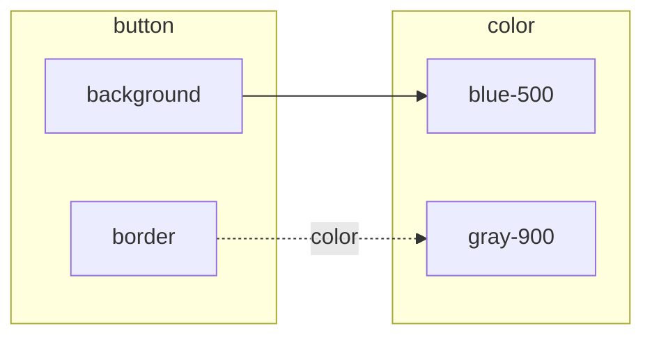

# dtgraph

Command-line interface for [dtgraph](https://github.com/julien-deramond/dtgraph): render and
validate [DTCG](https://www.designtokens.org/tr/2025.10/format/) design token files.

## Install

```sh
npm install --global dtgraph
```

Or run it without installing, via `npx`:

```sh
npx dtgraph <command> ...
```

## Usage

### `dtgraph render <files...> [-o, --output <file>] [-c, --context <modifier=context>] [--format svg|mermaid]`

Parses and resolves one or more DTCG token files (aliases are resolved across files when more
than one is given) and renders the result to an SVG token graph, or to [Mermaid](#mermaid-output)
text. If one of the files is a [resolver](#resolver-files), it drives the merge.

```sh
dtgraph render tokens.json -o graph.svg
dtgraph render color.json typography.json -o graph.svg
dtgraph render tokens.json > graph.svg   # no -o: SVG is written to stdout
dtgraph render ds.resolver.json base.json themes/*.json components.json -c theme=dark -o dark.svg
dtgraph render tokens.json --format mermaid -o graph.mmd
dtgraph render tokens.json --format mermaid --fence   # paste the output into a README, issue or PR
```

| Flag                              | Description                                                             |
| --------------------------------- | ----------------------------------------------------------------------- |
| `-o, --output <file>`             | Write the output to this file instead of stdout                         |
| `-c, --context <modifier=context>` | With a resolver: select a modifier context (repeatable, or comma-separated) |
| `--format <format>`               | `svg` (default) or `mermaid`                                            |
| `--fence`                         | With `--format mermaid`: wrap the diagram in a ` ```mermaid ` code fence |
| `--full-paths`                    | With `--format mermaid`: label nodes with their full token path, not the last segment |

#### Mermaid output

GitHub, GitLab, Notion and most docs tools render [Mermaid](https://mermaid.js.org/) diagrams
from plain text, so `--format mermaid` gives a token graph you can paste where an image would
have to be hosted. It is a `flowchart LR` with one subgraph per top-level group, alias edges as
solid arrows and composite-member edges as dotted arrows labeled with the member (`color` on a
`border` token), each pointing from the token that references to the token referenced:



Mermaid lays the diagram out itself and becomes hard to read past a couple hundred tokens;
renderers also refuse diagrams over their limits (by default 50,000 characters or 500 edges).
Use it to share a slice of a token set — one file, one theme — and the
[playground](https://julien-deramond.github.io/dtgraph/) to explore a whole one.

### `dtgraph validate <files...> [--json] [-c, --context <modifier=context>]`

Parses, resolves, and cycle-checks one or more DTCG token files without producing any output
artifact — useful in CI. Prints a one-line summary by default, or the full structured result
with `--json`. With a [resolver](#resolver-files), both name the resolver and the contexts applied.

```sh
dtgraph validate tokens.json
dtgraph validate color.json typography.json --json
dtgraph validate ds.resolver.json base.json themes/*.json components.json --context theme=dark
```

| Flag                              | Description                                                             |
| --------------------------------- | ----------------------------------------------------------------------- |
| `--json`                          | Print a machine-readable JSON result instead of a summary               |
| `-c, --context <modifier=context>` | With a resolver: select a modifier context (repeatable, or comma-separated) |

## Resolver files

A [DTCG resolver](https://www.designtokens.org/tr/2025.10/resolver/) (`*.resolver.json`)
composes a design system's token files from **sets** and **modifiers** with named **contexts**
(`theme: light | dark`), in a `resolutionOrder` where later sources override earlier ones. Pass
the resolver together with every token file it references; the CLI detects it by shape (an object
with a `resolutionOrder` array), resolves its `$ref`s against the files given (exact path, then
relative to the resolver, then by unique file name), applies `--context` or each modifier's
`default`, merges with override semantics, and only then resolves aliases. Same-document
`#/sets/…` references, inline sources, `file.json#/pointer` sub-trees and `$ref` override keys
are supported; remote references are not fetched. See
[`examples/resolver-themes`](../../examples/resolver-themes) for a runnable example.

## Exit codes

| Code | Meaning                                                                 |
| ---- | ------------------------------------------------------------------------ |
| `0`  | Success — files parsed, aliases resolved, no cycles found              |
| `1`  | Failure — malformed JSON/DTCG or resolver, a dangling alias, an alias cycle, an unknown modifier/context, or a cross-file token-path collision (without a resolver) |

On failure, the error message printed (or, with `--json`, the `error.message` field) comes
directly from `@dtgraph/core` — it is never re-wrapped or genericized, so it always includes the
offending token path and a link to the relevant part of the DTCG spec.

## Example

See [`examples/basic-tokens`](../../examples/basic-tokens) for a runnable example against a
small sample token file, and [`examples/resolver-themes`](../../examples/resolver-themes) for a
resolver-driven light/dark setup.
